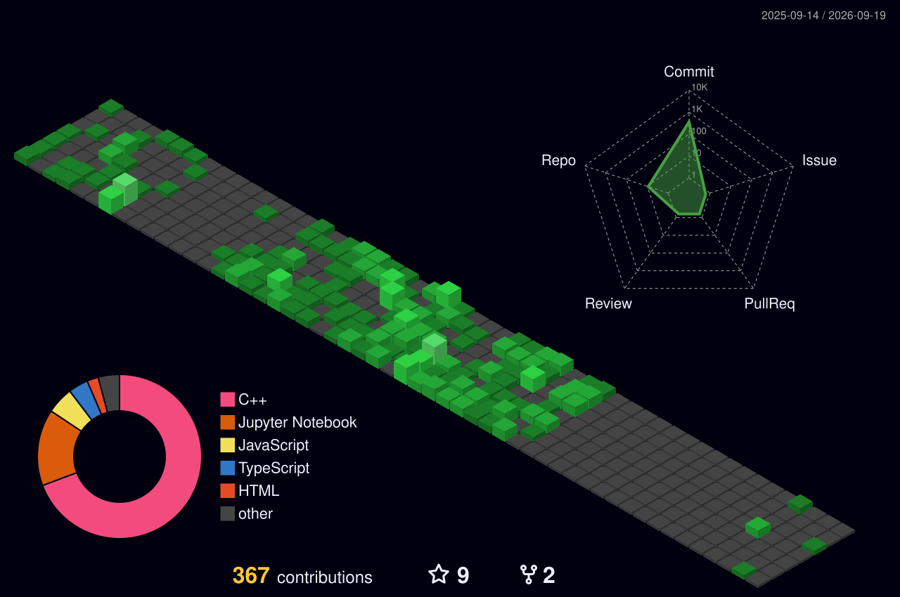

<h1 align="center">
  
</h1>

---

## 💫 About Me:
<h3 align="center">A passionate MERN Stack Developer & AI/ML Enthusiast from India</h3>

- 🔭 I’m currently working on **MERN Stack Projects** and exploring **AI/ML**  
- 🌱 I’m learning **DSA in C++, Machine Learning, and practicing advanced backend**  
- 👯 I’m open to collaborating on **exciting real-world projects and hackathons**  
- 💬 Ask me about **React.js, Node.js, MongoDB, Express.js, AI/ML Basics**  
- 📫 Reach me at: **palsusovan88@gmail.com**  
- ⚡ Fun fact: *If my project works on the first try, it’s probably a copy-paste project 😂*

---

## 🌐 Connect with me:

  
  
  
  

---

## 🛠️ Tech Stack:

  
  
  
  
  
  
  
  
  
  

---

## 📊 GitHub Stats:

  
  
  

---
<h2>   &nbsp;My GitHub History! 📈</h2>

---

## 🏅 LeetCode Progress:

  

---

## 🏅 LeetCode Badges:

  
  

---

## 📌 Pinned Projects:
- [🌿 OxyTrack.com](https://github.com/Susovan88/OxyTrack.com)  
  *A web app to track oxygen availability during emergencies, built with MERN Stack.*  

- [🚌 YatraX](https://github.com/Susovan88/YatraX)  
  *A RedBus-inspired bus booking system with unique features for hackathons.*  

- [💻 MERN_project](https://github.com/Susovan88/MERN_project)  
  *A full-stack web app to showcase CRUD operations and API integrations.*  

---

## 📚 Currently Learning:
- 📌 **DSA in C++**  
- 📌 **Starting Machine Learning**  
- 📌 **Practicing Advanced Backend Concepts**

---

## 🏆 Achievements:
- 🥇 **Winner** of *Exathon 2025*  
- 🚀 **Participated in ISRO Hackathon 2025*  

---

## 🏆 GitHub Trophies:

  

  

---

### 🔝 Top Contributed Repo

  

---

  

---

  

---
